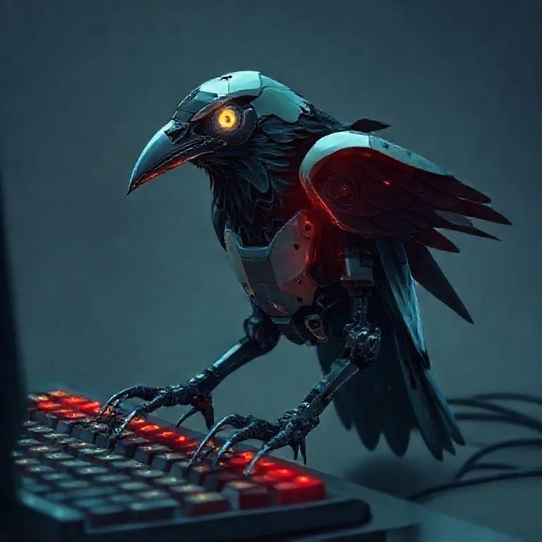

<p align="center">
  
</p>


# crow

<!--```
 ▄████▄   ██▀███   ▒█████   █     █░
▒██▀ ▀█  ▓██ ▒ ██▒▒██▒  ██▒▓█░ █ ░█░
▒▓█    ▄ ▓██ ░▄█ ▒▒██░  ██▒▒█░ █ ░█ 
▒▓▓▄ ▄██▒▒██▀▀█▄  ▒██   ██░░█░ █ ░█ 
▒ ▓███▀ ░░██▓ ▒██▒░ ████▓▒░░░██▒██▓ 
░ ░▒ ▒  ░░ ▒▓ ░▒▓░░ ▒░▒░▒░ ░ ▓░▒ ▒  
  ░  ▒     ░▒ ░ ▒░  ░ ▒ ▒░   ▒ ░ ░  
░          ░░   ░ ░ ░ ░ ▒    ░   ░  
░ ░         ░         ░ ░      ░    
░                                   
```-->

<p align="center">
  <strong>AI-Powered Coding Agent with Full Observability</strong>
</p>

<p align="center">
  
  
  
  
</p>

---

<p align="center">
  
</p>

---

## ✨ Features

- **🔮 Streaming Agent Execution** — Watch AI reasoning unfold in real-time
- **🛠️ Built-in Tool Suite** — Read, Write, Edit, Bash, Glob, Grep, and more
- **📸 Project Snapshots** — Git-backed state tracking for every change
- **🧠 Multi-Provider Support** — Anthropic, OpenAI, Moonshot, and local models
- **🎯 Session Management** — Persistent conversation history with full context
- **📋 Todo Tracking** — Built-in task management for complex workflows

---

## 🚀 Quick Start

### Prerequisites

- [Rust](https://rustup.rs/) (1.75+)
- [Node.js](https://nodejs.org/) (20+)
- [Bun](https://bun.sh/) (recommended) or npm

### Installation

```bash
# Clone and enter the project
cd crow-tauri

# Install frontend dependencies
bun install

# Run in development mode
bun run tauri dev
```

### CLI Usage

```bash
# Build the CLI
cargo build --release --bin crow-cli

# Start a chat
crow-cli chat "explain this codebase"

# Interactive REPL mode
crow-cli repl

# List sessions
crow-cli sessions
```

---

## 🎨 Color Scheme

| Color | Usage |
|-------|-------|
| 🟪 **Purple** | Tool names, headers, branding |
| 🔮 **Light Purple** | Agent thinking/reasoning |
| 🟩 **Green** | Success, completions, output |
| 🟨 **Yellow** | Warnings, in-progress states |
| 🟥 **Red** | Errors |

---

## 📁 Project Structure

```
crow-tauri/
├── src/                    # React frontend
│   ├── components/         # UI components
│   ├── hooks/              # Custom React hooks
│   └── pages/              # Page components
├── src-tauri/
│   ├── app/                # Tauri application
│   └── core/               # Crow core library
│       ├── agent/          # Agent execution engine
│       ├── providers/      # LLM provider clients
│       ├── session/        # Session management
│       ├── tools/          # Built-in tools
│       └── prompts/        # System prompts
└── docs/                   # Documentation
```

---

## 🔧 Configuration

Set your API keys:

```bash
export ANTHROPIC_API_KEY="sk-ant-..."
# or
export OPENAI_API_KEY="sk-..."
```

---

## 📜 License

Apache-2.0

---

<p align="center">
  <sub>Inspired by <a href="https://opencode.ai"[OpenCode](https://opencode.ai)</a></sub>
</p>
