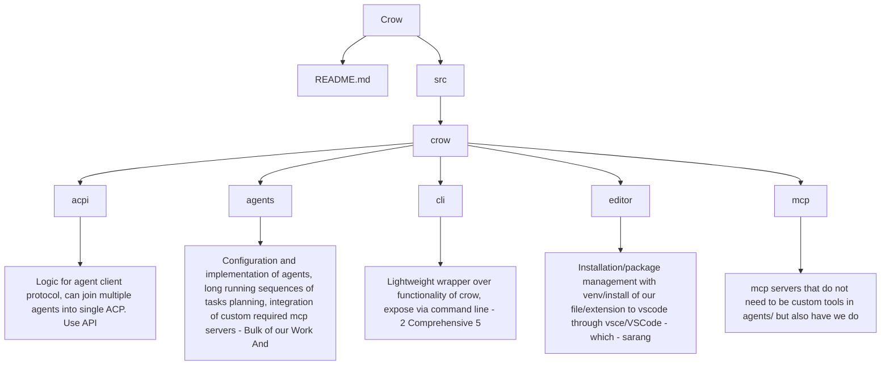

# Crow Refactoring Plan

## Project Structure

```
Crow/
├── README.md
└── src/
    └── crow/
        ├── acpi/
        │   └── [Logic for agent client protocol, can join multiple agents into single ACP. Use API]
        ├── agents/
        │   └── [Configuration and implementation of agents, long running sequences of tasks (planning), integration of custom required mcp servers] - Bulk of our value add
        ├── cli/
        │   └── [Comprehensive wrapper over all functionality of crow, exposed via command line]
        ├── editor/
        │   └── [Package management with `uv tool install` of our fork/extension of vscode through vscodium and code server]
        └── mcp/
            └── [mcp servers that do not need to be custom tools in agents but are always required so we ship together]
```

## Architecture Diagram



## Component Descriptions

### acpi/
**Agent Client Protocol Implementation**
- Logic for agent client protocol
- Can join multiple agents into single ACP
- Use API for communication

### agents/
**Agent Configuration and Implementation**
- Configuration and implementation of agents
- Long running sequences of tasks (planning)
- Integration of custom required MCP servers
- **Bulk of our Work And** (primary development area)

### cli/
**Command Line Interface**
- Lightweight wrapper over functionality of crow
- Expose via command line
- Comprehensive functionality

### editor/
**Editor Integration**
- Installation/package management with venv
- Install of our file/extension to VSCode through vsce
- VSCode integration wrapper
- (Attribution: sarang)

### mcp/
**Model Context Protocol Servers**
- MCP servers that do not need to be custom tools in agents/
- Shared MCP infrastructure

## Notes

- Captured from whiteboard planning session
- "Bulk of our Work And" indicates agents/ is the primary development focus
- Editor integration attributed to sarang
- CLI marked as "2 [Comprehensive] 5" (priority or complexity indicator?)
